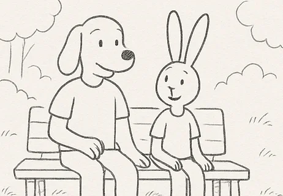
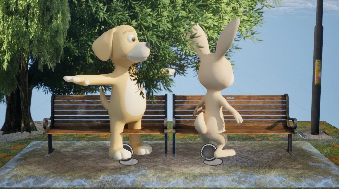
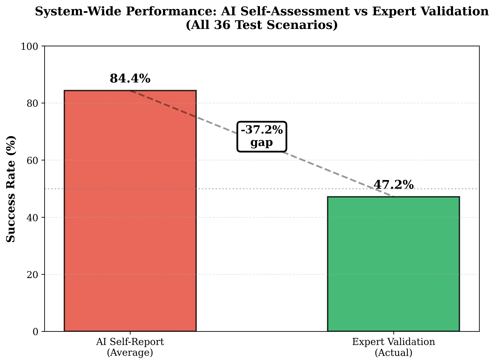
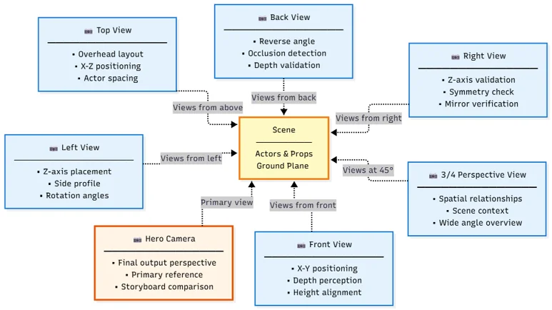
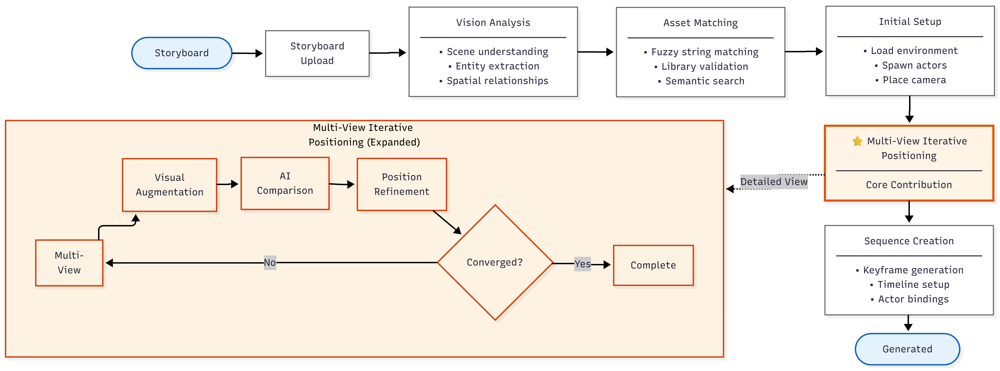
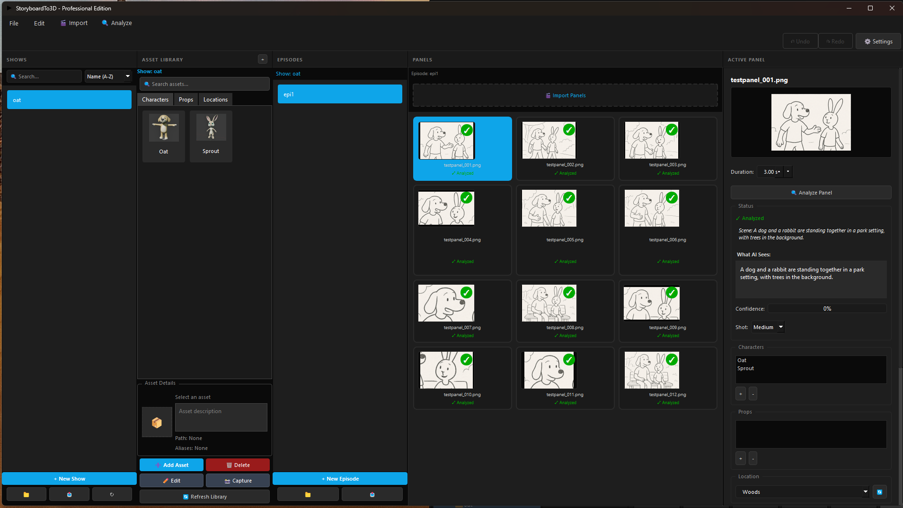

# StoryboardTo3D

**AI-powered storyboard-to-3D scene generation for Unreal Engine 5**

[](https://www.unrealengine.com/)
[](https://www.python.org/)
[](https://drexel.edu/)
[]()

An Unreal Engine plugin that automatically converts 2D storyboard panels into positioned 3D scenes using vision-language models. Developed as MS Thesis research at Drexel University.

<p align="center">
  <a href="https://vimeo.com/1152943813"></a>
  <br>
  <em>▶️ <a href="https://vimeo.com/1152943813">Watch Demo Video</a></em>
</p>

<p align="center">
  
  &nbsp;&nbsp;→&nbsp;&nbsp;
  
</p>
<p align="center"><em>Storyboard panel → AI-positioned 3D scene</em></p>

---

## Research Discovery

This research revealed a significant **calibration gap** in vision-language models performing spatial reasoning tasks:

| Model | Reported Confidence | Actual Accuracy | Calibration Error |
|-------|---------------------|-----------------|-------------------|
| Claude Sonnet 3.5 | 84.8% | **83.3%** | +1.5% |
| LLaVA-13B | 84.6% | 41.7% | +42.9% |
| GPT-4o | 83.8% | 16.7% | +67.1% |

**Key finding:** Models report ~84% confidence while achieving wildly different success rates. Claude Sonnet achieved 83.3% positioning accuracy—**5× better than GPT-4o**—despite similar confidence scores.

<p align="center">
  
</p>

---

## Publications & Archives

📄 **Full Thesis:**
- [ProQuest Dissertations & Theses](https://www.proquest.com/docview/3284362822)
- [Drexel University Research Discovery](https://researchdiscovery.drexel.edu/esploro/outputs/graduate/AI-powered-storyboard-to-3D-scene-generation/991022138782104721)
- [PDF Download](docs/Varacchi_StoryboardTo3D_Thesis_2025.pdf)

---

## How It Works

The system uses a **7-camera capture array** to expose spatial positioning errors invisible from single viewpoints:

<p align="center">
  
</p>

An **iterative AI feedback loop** refines positioning until the scene converges on the target composition:

1. **Panel Analysis** — AI extracts characters, props, camera angle from storyboard
2. **Scene Construction** — Assets placed at initial positions in UE5
3. **Multi-Angle Capture** — 7 cameras capture current state
4. **AI Evaluation** — Model compares captures to reference, suggests adjustments
5. **Refinement** — Positions updated based on feedback
6. **Repeat** — Loop continues until convergence or max iterations

<p align="center">
  
</p>

---

## Features

- **Multi-Model Support** — Claude, GPT-4o, LLaVA (local via Ollama)
- **7-Camera Spatial Validation** — Catches depth/positioning errors
- **Iterative Refinement** — Automatic convergence with configurable thresholds
- **Show/Episode Organization** — Production-oriented asset management
- **Level Sequence Integration** — Exports to UE5 Sequencer
- **Metrics Tracking** — Logs accuracy, iterations, confidence per model

---

## Installation

### Requirements

- Unreal Engine 5.4+
- Python 3.11+
- PySide6 (`pip install PySide6`)
- API key for Claude or OpenAI (optional: Ollama for local inference)

### Setup

1. **Clone** into your project's `Plugins/` folder:
   ```bash
   cd YourProject/Plugins
   git clone https://github.com/tylervaracchi/storyboard-to-3d.git StoryboardTo3D
   ```

2. **Enable Python scripting** in your project:
   ```
   Edit → Plugins → Python Editor Script Plugin → Enable
   ```

3. **Install Python dependencies**:
   ```bash
   pip install -r Plugins/StoryboardTo3D/Content/Python/requirements.txt
   ```

4. **Configure API keys** (choose one):
   
   **Option A: Environment variables** (recommended)
   ```bash
   # Windows
   setx ANTHROPIC_API_KEY "sk-ant-..."
   setx OPENAI_API_KEY "sk-..."
   
   # Linux/Mac
   export ANTHROPIC_API_KEY="sk-ant-..."
   ```
   
   **Option B: Settings file**
   
   Create `~/.storyboard_to_3d/.env`:
   ```
   ANTHROPIC_API_KEY=sk-ant-...
   OPENAI_API_KEY=sk-...
   ```

5. **Restart** Unreal Engine

### Launch

In Unreal's Python console:
```python
import sys
sys.path.append("Plugins/StoryboardTo3D/Content/Python")
import main
main.show_window()
```

<p align="center">
  
</p>

---

## Project Structure

```
StoryboardTo3D/
├── Source/                     # C++ UE5 bridge
│   └── StoryboardTo3D/
│       ├── Public/             # Headers
│       └── Private/            # Implementation
├── Content/Python/             # Core functionality
│   ├── api/                    # AI client (Claude, GPT-4o, LLaVA)
│   ├── core/                   # Scene builder, camera, positioning
│   │   └── ai_providers/       # Model-specific implementations
│   ├── analysis/               # Metrics, validation, visualization
│   ├── ai_vision/              # Viewport capture, scene matching
│   ├── ui/                     # Qt interface
│   │   ├── widgets/            # Panel, asset library, show manager
│   │   ├── settings/           # Configuration dialogs
│   │   └── themes/             # Dark theme
│   ├── config/                 # API key management
│   ├── utils/                  # Token counting, helpers
│   └── tests/                  # Positioning test suite
├── Resources/                  # Plugin icons
└── StoryboardTo3D.uplugin      # Plugin manifest
```

---

## Configuration

Settings are stored in `~/.storyboard_to_3d/settings.json`:

```json
{
  "api": {
    "provider": "Claude 3.5 Sonnet",
    "timeout": 30,
    "max_retries": 3
  },
  "generation": {
    "default_panel_duration": 3.0,
    "create_cameras": true,
    "create_lights": true
  }
}
```

---

## Research Context

This plugin was developed as part of my MS Thesis at Drexel University:

**"Automated Storyboard-to-3D Scene Generation: Evaluating Vision-Language Model Spatial Reasoning Through Iterative Refinement"**

The research contributes:
- Quantified calibration gaps in VLM spatial reasoning
- Multi-view validation methodology for 3D positioning
- Comparative analysis across commercial and open-source models
- Production-ready UE5 implementation

---

## Citation

If you reference this work in academic research:

```bibtex
@mastersthesis{varacchi2025storyboard,
  title={AI-Powered Storyboard-to-3D Scene Generation: Evaluating Vision-Language Model Spatial Reasoning Through Iterative Refinement},
  author={Varacchi, Tyler},
  school={Drexel University},
  year={2025},
  type={Master's Thesis},
  url={https://www.proquest.com/docview/3284362822}
}
```

---

## Limitations

- **Asset library required** — Models cannot create assets, only position existing ones
- **Simplified scenes** — Best results with 2-4 characters, clear compositions
- **API costs** — Cloud models incur per-request charges (~$0.01-0.05/panel)
- **Local inference** — LLaVA requires 16GB+ RAM, significantly slower

---

## License

**All Rights Reserved** — This code is provided for viewing and portfolio demonstration only. See [LICENSE](LICENSE) for details.

---

## Author

**Tyler Varacchi**  
MS Digital Media, Drexel University

[tylervaracchi.com](https://tylervaracchi.com) · [LinkedIn](https://linkedin.com/in/tyler-varacchi) · [GitHub](https://github.com/tylervaracchi)
