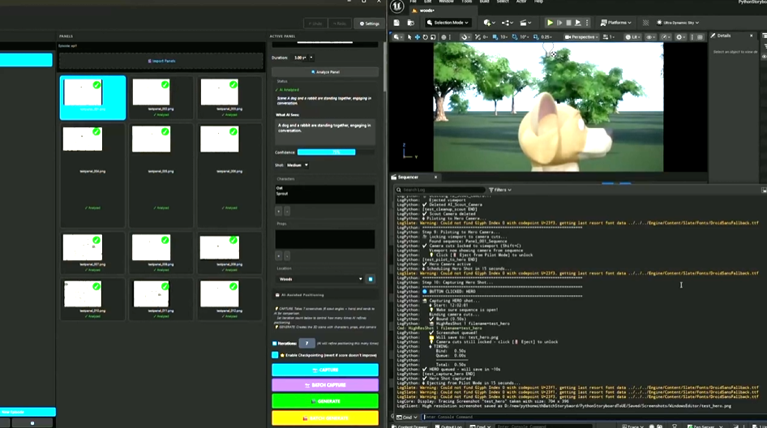
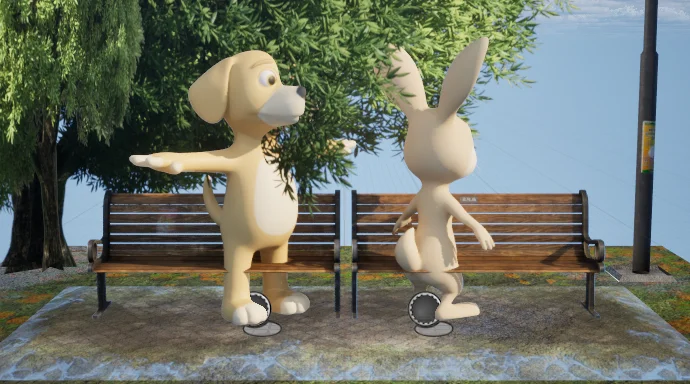
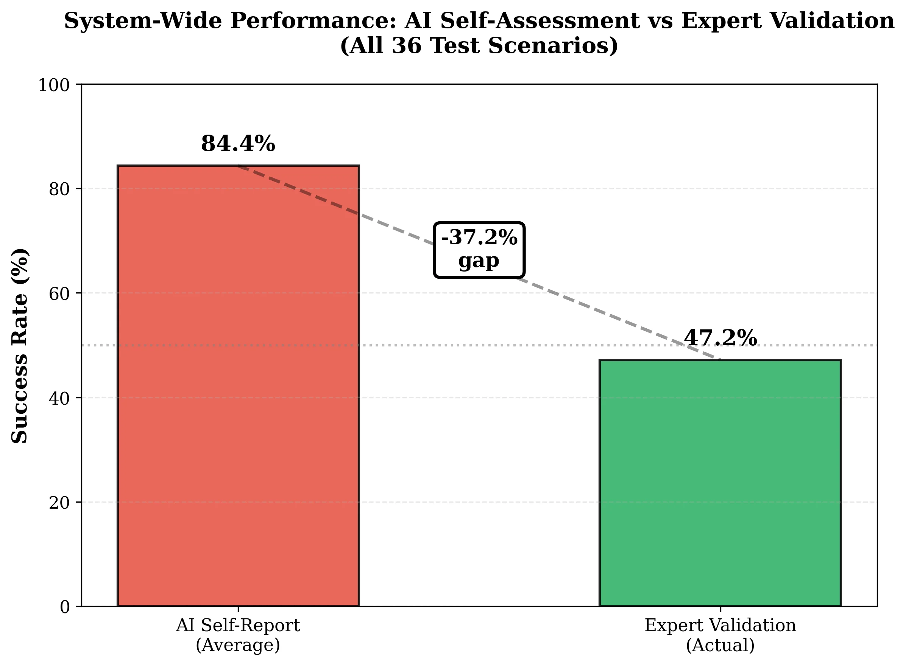
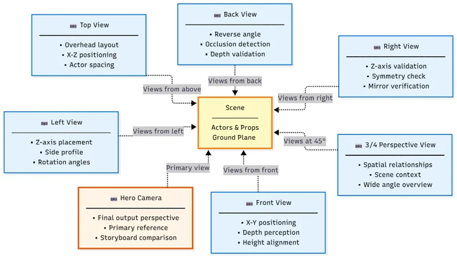
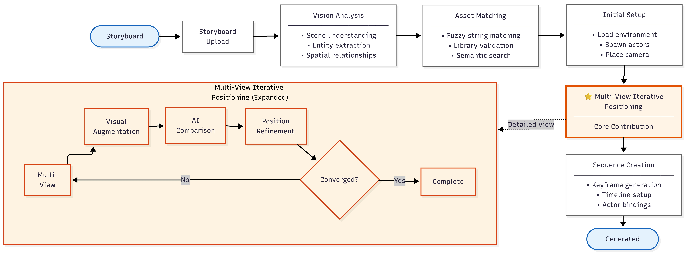
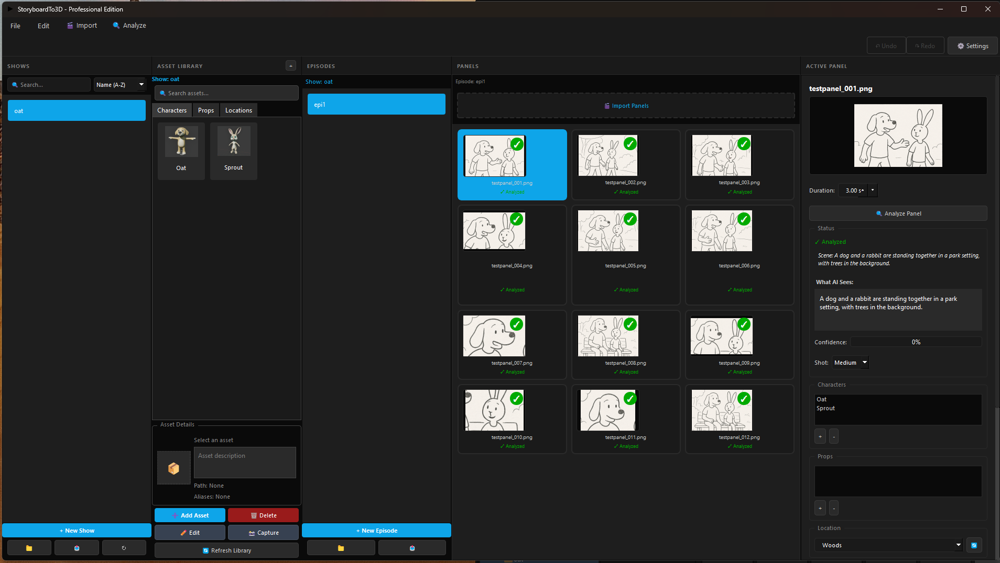

# StoryboardTo3D

**AI-powered storyboard-to-3D scene generation for Unreal Engine 5**

[](https://www.unrealengine.com/)
[](https://www.python.org/)
[](https://drexel.edu/)
[](LICENSE)

An Unreal Engine plugin that automatically converts 2D storyboard panels into positioned 3D scenes using vision-language models. Developed as MS Thesis research at Drexel University.

> 🔧 **SensAI Worlds in Action Hack [02-LA] (July 18–19, 2026):** this plugin is in the hacker toolkit. Clone it, build with it. I'm on site Saturday for questions, and at SIGGRAPH all week (poster: West Hall Lobby, Mon–Wed 12–1).

<p align="center">
  <a href="https://vimeo.com/1152943813"></a>
  <br>
  <em>▶️ <a href="https://vimeo.com/1152943813">Watch Demo Video</a></em>
</p>

<p align="center">
  
  &nbsp;&nbsp;→&nbsp;&nbsp;
  
</p>
<p align="center"><em>Storyboard panel → AI-positioned 3D scene</em></p>

---

## Research Discovery

This research revealed a significant **calibration gap** in vision-language models performing spatial reasoning tasks:

| Model | Reported Confidence | Actual Accuracy | Calibration Error |
|-------|---------------------|-----------------|-------------------|
| Claude Sonnet 4.5 | 84.8% | **83.3%** | +1.5% |
| LLaVA-13B | 84.6% | 41.7% | +42.9% |
| GPT-4o | 83.8% | 16.7% | +67.1% |

**Key finding:** Models report ~84% confidence while achieving wildly different success rates. Claude Sonnet achieved 83.3% positioning accuracy—**5× better than GPT-4o**—despite similar confidence scores.

<p align="center">
  
</p>

---

## Publications & Archives

🖼️ **SIGGRAPH 2026 Posters:**
- "AI Score Hallucination in Vision-Language Models: Measuring Self-Assessment Calibration for Iterative 3D Scene Positioning" — Los Angeles, July 2026
- Poster, extended abstract, and ACM link: [tylervaracchi.com/paper](https://tylervaracchi.com/paper)

📄 **Full Thesis:**
- [ProQuest Dissertations & Theses](https://www.proquest.com/docview/3284362822)
- [Drexel University Research Discovery](https://researchdiscovery.drexel.edu/esploro/outputs/graduate/AI-powered-storyboard-to-3D-scene-generation/991022138782104721)
- [PDF Download](docs/Varacchi_StoryboardTo3D_Thesis_2025.pdf)

---

## How It Works

The system uses a **7-camera capture array** to expose spatial positioning errors invisible from single viewpoints:

<p align="center">
  
</p>

An **iterative AI feedback loop** refines positioning until the scene converges on the target composition:

1. **Panel Analysis** — AI extracts characters, props, camera angle from storyboard
2. **Scene Construction** — Assets placed at initial positions in UE5
3. **Multi-Angle Capture** — 7 cameras capture current state
4. **AI Evaluation** — Model compares captures to reference, suggests adjustments
5. **Refinement** — Positions updated based on feedback
6. **Repeat** — Loop continues until convergence or max iterations

<p align="center">
  
</p>

---

## Features

- **Multi-Model Support** — Claude, GPT (4o and 5 family), Google Gemini, LLaVA (local via Ollama); Claude, OpenAI, and Gemini model dropdowns refresh from each vendor's live models API, so new models are selectable without code changes
- **Features Tab** — Every optional feature has an on/off switch in Settings > Features (all off by default except image transport optimization)
- **7-Camera Spatial Validation** — Catches depth/positioning errors
- **Iterative Refinement** — Automatic convergence with configurable thresholds
- **External Validation** — Optional independent check on the AI's self-score (see below)
- **Show/Episode Organization** — Production-oriented asset management
- **Level Sequence Integration** — Exports to UE5 Sequencer with per-panel durations
- **Animatic Rendering** — Movie Render Queue render of the master sequence (`core/animatic_renderer.py`)
- **USD Export** — Level export for Houdini/Maya/Omniverse pipelines (`core/usd_exporter.py`)
- **Importers** — Wonder Unit Storyboarder (`.storyboarder`) files and image folders (ComfyUI output) (`core/importers/`)
- **Script Breakdown** — Text-only LLM pass turning a script into a numbered shot list (`core/script_breakdown.py`)
- **Headless Batch Mode** — Single-pass analyze+generate over a whole episode from the UE Python console (`core/batch_runner.py`)
- **Semantic Asset Matching** — Optional embedding-based matching so "canine" finds the dog asset (off by default; `asset_library.semantic_matching`)
- **Generative 3D Fallback** — When the library has no match at all, optionally generate the missing asset via Meshy or Tripo3D, import it, and add it to the show library so it is reused, not re-bought (off by default; `gen3d.enabled`, capped by `gen3d.max_per_run`)
- **Mood Lighting** — Maps the panel's analyzed mood (night, golden hour, noir, tense...) to directional/sky light and fog presets (off by default; `scene.apply_mood_lighting`)
- **Animation Picker** — Matches each character's action text ("running", "sits on a bench") to a tagged animation library and plays it on skeletal actors (off by default; `scene.auto_animation`, see `samples/animation_library.sample.json`)
- **Generative Animation Fallback** — When the animation library has no clip for an action, optionally generate one via Tripo (preset animate-retarget) or DeepMotion SayMotion (true text-to-motion), import it to `/Game/StoryboardTo3D/GeneratedAnims`, and add it to the show library so it is reused, not regenerated (off by default; `genanim.enabled`, capped by `genanim.max_per_run`; clips arrive on the provider's skeleton and retarget via UE's IK Retargeter)
- **AI Librarian** — Auto-catalog the show library with the configured vision provider: assets are described from their thumbnails (one small image call each; "AI Describe" / "AI Describe All" buttons, `core/asset_cataloger.py`) and animations from three sampled poses composed into a contact sheet (`core/animation_cataloger.py`, MCP tool `catalog_animations`), filling descriptions and aliases so matching survives badly named assets and clips; the same semantic-matching toggle also adds an embedding tier to animation matching
- **Camera Moves** — Shot type drives a subtle camera move in the shot sequence: close-ups push in, mediums drift, wides pan (off by default; `sequence.camera_moves`)
- **Cost Controls** — Pre-run cost estimates (`utils/cost_estimator.py`), cheap-model re-scoring, Files API image reuse, and a 50%-off Batch API client
- **Live Iteration Progress** — Score sparkline, pre-run cost estimate, running spend, and a Cancel button shown next to the refinement loop while it runs (`ui/widgets/iteration_progress.py`)
- **First-Run Welcome** — When no shows exist yet, the main window offers one-click actions: create a first show, load a bundled sample show (sample panels plus starter asset library), or open the Quick Start
- **Tools Menu** — Render Animatic, Export Level as USD, Calibration Dashboard, and Overnight Batch are reachable from the main window's Tools menu (previously console-only)
- **A/B Provider Comparison** — Same panel through two providers with transform snapshot/restore (`core/ab_comparison.py`)
- **Metrics Tracking** — Logs accuracy, iterations, confidence per model, plus a calibration dashboard chart (`analysis/calibration_dashboard.py`)

### Performance

Image transport optimization is on by default (`performance.optimize_images`): captures are downscaled to a 1288 px long edge and re-encoded as JPEG before hitting the API, typically 5-10x smaller payloads with no effect on VLM judgment (Anthropic server-side downscales anything over 1568 px anyway). Both providers reuse keep-alive HTTP sessions across iteration calls. Opt-in extras: `performance.reduced_refinement_views` captures 3 of 7 views on refinement iterations (the first iteration always gets the full set), and `ai_vision/scene_capture_rig.py` provides a viewport-independent SceneCapture2D rig that renders all 7 views in roughly a frame instead of piloting the editor viewport through them (wiring into the iteration loop is pending live-editor verification). Headless batch mode analyzes panels in parallel (`--workers N`).

### External validation (recommended)

The calibration study above is exactly why this exists: all three models reported roughly 84/100 confidence while their real success rates ranged from 17% to 83%, so **a VLM's self-score is not a usable stop signal on its own**. `ExternalValidator` cross-checks the hero capture against the storyboard with an independent signal: `"opencv"` (local image comparison, zero API cost), `"second_model"` (a *different* VLM returns only a 0-100 score plus a one-sentence reason), or `"both"` (conservative minimum of the two).

```python
from core.external_validator import ExternalValidator

validator = ExternalValidator(strategy="opencv")  # or "second_model" / "both"
result = validator.validate("storyboard.png", "hero_capture.png")
print(result["score"], result["details"], validator.agrees_with_self_score(self_score=84))
```

Enable it globally via the `validation.external_validation` setting (default `off`; options `off`, `opencv`, `second_model`, `both`), or from the Settings dialog (General tab). When enabled, the iteration loop cross-checks any would-be early stop (self-score above 80) against the external validator and gates acceptance on the conservative `min(self, external)` score, logged as `[ExternalValidation] self=NN external=NN effective=NN`. When off, behavior is unchanged.

---

## Installation

### Requirements

- Unreal Engine 5.4 - 5.8 (Python plugin layer; the C++ module compiles against each engine's toolchain)
- **Visual Studio 2022** with the "Game Development with C++" workload (the plugin has a small C++ module; UE will prompt to build it on first launch)
- API key for Claude or OpenAI (optional: Ollama for local inference)

#### Engine version support

| Engine version | Status | Notes |
|---|---|---|
| UE 5.4 | Supported | Ships embedded Python 3.9.7; the Python layer targets a 3.9 syntax floor |
| UE 5.5 | Supported | Ships embedded Python 3.11 |
| UE 5.6 | Developed on | Primary development and test version |
| UE 5.7 | Supported | |
| UE 5.8 | Supported | See MCP extras for 5.8 |

### Setup

1. **Clone** into your project's `Plugins/` folder:
   ```bash
   cd YourProject/Plugins
   git clone https://github.com/tylervaracchi/storyboard-to-3d.git StoryboardTo3D
   ```

2. **Enable Python scripting** in your project:
   ```
   Edit → Plugins → Python Editor Script Plugin → Enable
   ```

3. **Install Python dependencies — into Unreal's bundled Python** (not your system Python; UE uses its own interpreter):
   ```bash
   # Windows (adjust the engine path to your install)
   "C:\Program Files\Epic Games\UE_5.6\Engine\Binaries\ThirdParty\Python3\Win64\python.exe" -m pip install -r Plugins/StoryboardTo3D/Content/Python/requirements.txt
   ```

4. **Configure API keys** (choose one):
   
   **Option A: Environment variables** (recommended)
   ```bash
   # Windows
   setx ANTHROPIC_API_KEY "sk-ant-..."
   setx OPENAI_API_KEY "sk-..."
   
   # Linux/Mac
   export ANTHROPIC_API_KEY="sk-ant-..."
   ```
   
   **Option B: Settings file**
   
   Create `~/.storyboard_to_3d/.env`:
   ```
   ANTHROPIC_API_KEY=sk-ant-...
   OPENAI_API_KEY=sk-...
   ```

5. **Restart** Unreal Engine

### Launch

In Unreal's Python console:
```python
import sys
sys.path.append("Plugins/StoryboardTo3D/Content/Python")
import main
main.show_window()
```

<p align="center">
  
</p>

---

## Drive it with Claude (UE 5.8 MCP)

> **Experimental** and **UE 5.8+ only.** This integration builds on Epic's experimental ModelContextProtocol plugin that ships with Unreal Engine 5.8. On older engines the plugin logs one skip line at startup and nothing else changes.

UE 5.8 embeds an MCP server in the editor at `http://127.0.0.1:8000/mcp`. When that server is enabled, StoryboardTo3D auto-registers a toolset so MCP clients such as Claude Code can drive the storyboard pipeline directly, without the plugin UI.

1. Enable both plugins in `Edit → Plugins`: **ModelContextProtocol** (Epic, Experimental) and **StoryboardTo3D**, then restart the editor.
2. Generate a Claude Code client config from the Unreal console:
   ```
   ModelContextProtocol.GenerateClientConfig ClaudeCode
   ```
3. Start Claude Code. The storyboard tools are now callable.

Registered tools:

| Tool | What it does |
|------|--------------|
| `list_asset_library` | Returns the character / prop / location library (with descriptions) as JSON |
| `analyze_storyboard_panel` | Runs the AI panel analysis on an image file and returns the scene description JSON |
| `generate_scene_from_panel` | Full pipeline: analyzes a panel, then builds the 3D scene in the current level and returns a summary of placed actors |
| `capture_scene_views` | Triggers the 7-view capture and returns the capture file paths; with `include_images=True` it also embeds base64 PNGs so the client can *see* the scene |
| `validate_scene` | Runs the external validator (opencv / second_model / both) on the storyboard vs the newest hero capture and returns the independent score |
| `render_animatic` | Kicks off a Movie Render Queue render of the master sequence |
| `get_project_info` | Plugin version, engine version, and the configured AI provider |

Notes: tool calls run on the editor's game thread, so long operations (scene generation, AI analysis) block the editor while they run. `capture_scene_views` queues screenshots that land in `Saved/Screenshots/WindowsEditor/` a few seconds after the call returns — to get fresh embedded images, call it once to queue, wait, then call again with `include_images=True`.

---

## Project Structure

```
StoryboardTo3D/
├── Source/                     # C++ UE5 bridge
│   └── StoryboardTo3D/
│       ├── Public/             # Headers
│       └── Private/            # Implementation
├── Content/Python/             # Core functionality
│   ├── api/                    # AI client (Claude, GPT-4o, LLaVA)
│   ├── core/                   # Scene builder, camera, positioning
│   │   └── ai_providers/       # Model-specific implementations
│   ├── analysis/               # Metrics, validation, visualization
│   ├── ai_vision/              # Viewport capture, scene matching
│   ├── ui/                     # Qt interface
│   │   ├── widgets/            # Panel, asset library, show manager
│   │   ├── settings/           # Configuration dialogs
│   │   └── themes/             # Dark theme
│   ├── config/                 # API key management
│   ├── utils/                  # Token counting, helpers
│   └── tests/                  # Positioning test suite
├── Resources/                  # Plugin icons
└── StoryboardTo3D.uplugin      # Plugin manifest
```

---

## Configuration

Settings are stored in `~/.storyboard_to_3d/settings.json`:

```json
{
  "api": {
    "provider": "Claude 3.5 Sonnet",
    "timeout": 30,
    "max_retries": 3
  },
  "generation": {
    "default_panel_duration": 3.0,
    "create_cameras": true,
    "create_lights": true
  }
}
```

---

## Research Context

This plugin was developed as part of my MS Thesis at Drexel University:

**"Automated Storyboard-to-3D Scene Generation: Evaluating Vision-Language Model Spatial Reasoning Through Iterative Refinement"**

The research contributes:
- Quantified calibration gaps in VLM spatial reasoning
- Multi-view validation methodology for 3D positioning
- Comparative analysis across commercial and open-source models
- Production-ready UE5 implementation

---

## Citation

If you reference this work in academic research:

```bibtex
@mastersthesis{varacchi2025storyboard,
  title={AI-Powered Storyboard-to-3D Scene Generation: Evaluating Vision-Language Model Spatial Reasoning Through Iterative Refinement},
  author={Varacchi, Tyler},
  school={Drexel University},
  year={2025},
  type={Master's Thesis},
  url={https://www.proquest.com/docview/3284362822}
}
```

---

## Limitations

- **Asset library required** — Models cannot create assets, only position existing ones
- **Simplified scenes** — Best results with 2-4 characters, clear compositions
- **API costs** — Cloud models incur per-request charges (~$0.01-0.05/panel)
- **Local inference** — LLaVA requires 16GB+ RAM, significantly slower

---

## License

**MIT** — free to use, modify, and distribute with attribution. See [LICENSE](LICENSE) for details. (The thesis document in docs/ remains (c) Tyler Varacchi.)

---

## Author

**Tyler Varacchi**  
MS Digital Media, Drexel University

[tylervaracchi.com](https://tylervaracchi.com) · [LinkedIn](https://linkedin.com/in/tyler-varacchi) · [GitHub](https://github.com/tylervaracchi)
